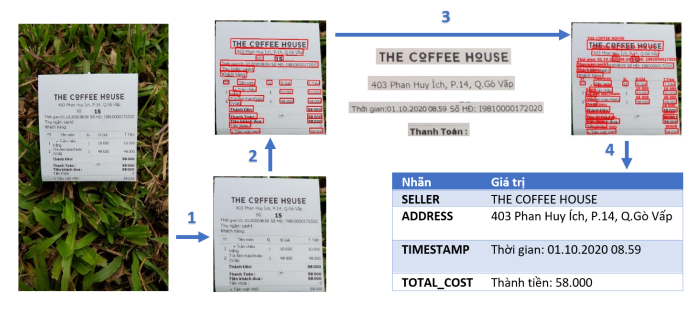

# Information Extraction for Vietnamese Receipts in the wild

This repository is final project of CS532 course - CVCI at UIT-VNUHCM. This project aims to build a API for extracting Vietnamese Receipts in the wild in real time. 

The author:
- Nguyen Le Anh Quan - 19522081
- Nguyen Kha Tien - 19522337
- Nguyen Thanh Vinh

____
## 1) Our processing pipeline:  



## 2) How to run: 
Using ```docker-compose``` to easily run the project. You can change the local database environment in ```config/db.env```.
```
COMPOSE_DOCKER_CLI_BUILD=1 DOCKER_BUILDKIT=1 docker-compose --env-file=config/db.env up --build
```

**Note:**
- The VietOCR TensorRT model was build on RTX2080Ti. You need at least a GPU with 12GB VRAM to run the whole system. To convert the VietOCR to your GPU, please follow [this repository](https://github.com/NNDam/vietocr-tensorrt) to rebuild.
